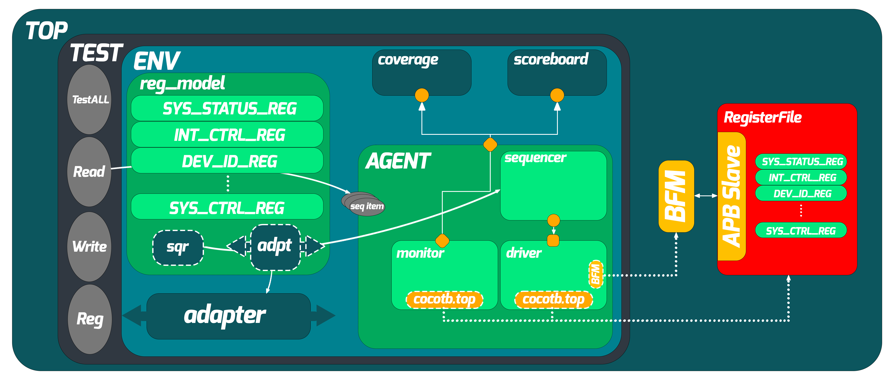
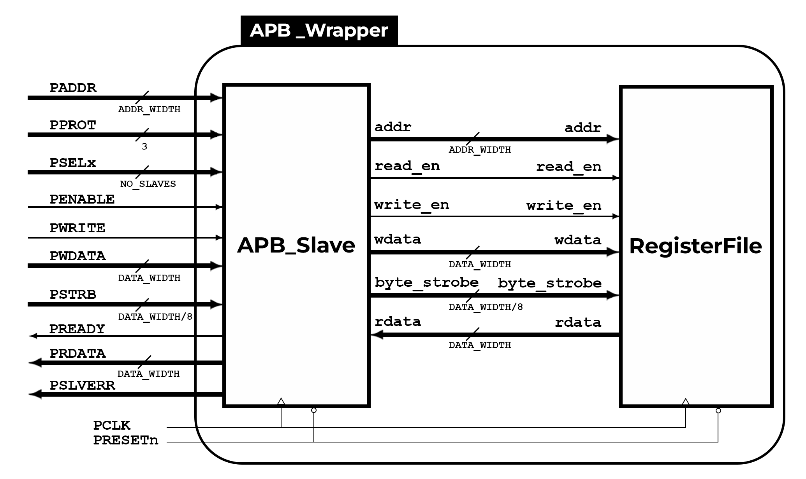

# Python-based Verification Environment for APB Slave
## Table of Contents

1. [Introduction](#introduction)
2. [UVM Structure](#uvm-structure)  
3. [Key Features](#key-features)
4. [RTL Overview](#rtl-overview)  
5. [Repository Structure](#repository-structure)  
6. [Installation & Setup](#installation--setup)  
7. [Simulation Flow (Makefile)](#simulation-flow-makefile)  
8. [Python Testbench Architecture](#python-testbench-architecture)  
9. [Register Abstraction Layer (RAL)](#register-abstraction-layer-ral)  
10. [Coverage Strategy](#coverage-strategy)  
11. [Randomization Strategy](#randomization-strategy)  
12. [Trade-offs: SV vs. Python Testbenches](#trade-offs-sv-vs-python-testbenches)  
13. [Future Migration Possibilities](#future-migration-possibilities)  
14. [Running the Tests](#running-the-tests)  
15. [Contributing](#contributing)  
16. [License](#license) 
17. [Contact](#contact) 

---

## Introduction

As Python rises in functional verification, it lacks some of SystemVerilog’s mature features for constrained-random and coverage.  This project demonstrates:

- A standard APB slave design in SystemVerilog.  
- A Python-centric testbench using Cocotb + PyUVM for structure, PyVSC for Python-native CRV/coverage, and PyQuesta’s **SVConduit** to borrow SV’s randomization and coverage engines.  
- A Python Register Abstraction Layer (RAL) for front-door register access.  

---

## UVM Structure



---

## Key Features

- **Hybrid CRV & Coverage** via three methods each:  
  - **PyVSC** – pure-Python randomization & coverage.  
  - **PyQuesta** – DPI-based SV randomization (`sv_get`) and SV coverage (`sv_put`) from Python.  
  - **cocotb-coverage** – implemented but not wired; example in `Testbench/SequenceItemCocotbCoverage.py`.  
- **PyUVM Sequences & Factory** for modular, reusable stimulus.  
- **Dedicated DPI Shim (`sv_conduit.so`)** that auto-builds and binds SV exports.  
- **Makefile** orchestrates DPI build, SV compile/elaboration, and Cocotb/PyUVM execution.  
- **Scalable RAL** classes for Python-based register operations.  

---

## RTL Overview

The RTL implements an APB slave device with standard AMBA APB interface signals, internal register file, and optional assertion checking (SVA). The RTL modules include:

- **APB_Slave.sv**: Implements core APB protocol handling (PREADY, PRDATA, PENABLE, etc.).
- **RegisterFile.sv**: Memory-mapped register bank for addressable data storage.
- **APB_Wrapper.sv**: Top module connecting slave, register file, and dummy DPI hooks.
- **APB_SVA.sv** and **SVA_bind.sv**: SystemVerilog Assertions verifying APB protocol compliance.

Assertions ensure correct timing and sequencing of APB transactions, strengthening functional correctness.

The RTL is kept lightweight and simple to allow a full Python-based verification flow to focus on CRV, coverage, and RAL interaction without unnecessary complexity.


---

## Repository Structure

```
├───Documentation/
│       APB_Wrapper.png
│
├───RAL/                                  # Python register-model API
│       Adapter.py
│       RegisterBlock.py
│       Registers.py
│
├───RTL/
│       APB_Slave.sv
│       APB_Wrapper.sv
│       RegisterFile.sv
│       shared_pkg.sv
│
├───Testbench/
│    ├── Agent.py
│    ├── APB_seq_item.svh
│    ├── APB_seq_item.yaml
│    ├── APB_seq_itemMod.py
│    ├── APB_seq_item_pkg.sv
│    ├── APB_SVA.sv
│    ├── APB_utils.py
│    ├── BFM.py
│    ├── Coverage.py
│    ├── Driver.py
│    ├── dummy_dpi_initializer.sv
│    ├── Environment.py
│    ├── Makefile
│    ├── Monitor.py
│    ├── Scoreboard.py
│    ├── SequenceItem.py
│    ├── SequenceItemCocotbCoverage.py     # cocotb-coverage example (unused)
│    ├── SequenceLibrary.py                # PyUVM sequences
│    ├── setup.tcl
│    ├── SVA_bind.sv
│    ├── Tests.py                          # @pyuvm.test tests
│
├───LICENSE
│
├───Coverage_Reports/                      # UCIS/XML, HTML exports
│   ├───Exported_by_cocotb-coverage/
│   │
│   ├───Exported_by_PyQuesta/
│   │
│   └───Exported_by_PyVSC/
│
├───README.md
```

---

## Installation & Setup

1. **Prerequisites**  
   - Python 3.6+ with `pip`  
   - Mentor QuestaSim (for DPI and SV coverage)  
   - `cocotb`, `pyuvm`, `pyvsc`, `pyquesta` installed in your Python venv  

2. **Install Python Packages**  
   ```bash
   pip install cocotb pyuvm pyvsc pyquesta
   ```

3. **Generate and Build DPI Shim**  
   ```bash
   cd $VIRTUAL_ENV/lib/python3.9/site-packages/pyquesta/makefiles
   make -f pyquesta.mk
   ```
   This produces `sv_conduit.so`.

---

## Simulation Flow (Makefile)

The top-level `Makefile` automates:

1. **Compile SystemVerilog** (RTL + dummy DPI initializer) with `vlog +acc -sv_lib sv_conduit.so`  
2. **Run cocotb/PyUVM** via `vsim ... -pli libcocotbvpi_modelsim.so ...`  

Just run:

```bash
make clean && make
```

---

## Python Testbench Architecture

- **ApbBfm** generates clocks and drives low-level signals.  
- **ApbAgent** instantiates driver & monitor and connects to the sequencer.  
- **Driver** translates `uvm_sequence_item` into bus pokes.  
- **Monitor** samples bus signals each cycle into a PyVSC `SequenceItem` and forwards to:  
  1. **PyVSC covergroup** (`.sample()`)  
  2. **SVConduit.put()** → SV coverage (`sv_put`)  
- **Sequences** defined in `SequenceLibrary.py` extend `ApbBaseSequence` and apply stimulus:  
  - **ApbWriteSequence**, **ApbReadSequence** (PyVSC random)  
  - **ApbPyquestaSequence** (SV random via `SVConduit.get()`)  
  - **ApbRegSequence** (RAL front-door register writes)  

---

## Register Abstraction Layer (RAL)

- **Adapter.py** maps Python register calls to APB transactions.  
- **Registers.py** & **RegisterBlock.py** define register fields, offsets, and data widths.  
- The `ApbRegSequence` uses RAL to perform front-door reads/writes via Python APIs (e.g. `reg.write()`).

---

## Coverage Strategy

**Three methods** are available (two active):

1. **PyVSC Coverage**  
   - Python covergroups on `SequenceItem` fields.  
   - `.sample(...)` called in the monitor.  
   - Exportable to JSON/HTML/UCIS.  

2. **PyQuesta Coverage**  
   - `SVConduit.put(item)` ships transactions to SV.  
   - SV-side `sv_put()` deserializes and calls an SV covergroup.  
   - Uses QuestaSim’s native coverage engines (UCIS/XML).  

3. **cocotb-coverage** (Example Stub)  
   - Defined in `SequenceItemCocotbCoverage.py` with `@covergroup`, but not wired in.  
   - Could be activated for pure-Python coverage if desired.

---

## Randomization Strategy

**Three methods** exist (two active):

1. **PyVSC Randomization**  
   - `@vsc.randobj` + `@vsc.constraint` objects.  
   - `randomize()` or `with randomize_with(): dist {…}` in sequences.  

2. **PyQuesta Randomization**  
   - `item_sv = SVConduit.get(APB_seq_item)` → calls SV `sv_get()`.  
   - SV randomizes via `randomize() with { … }`, serializes to string.  
   - Python deserializes into a Python object.  

3. **cocotb-coverage CRV** (Implemented Stub)  
   - Example in `SequenceItemCocotbCoverage.py` using cocotb-coverage’s `CoverPoint`.  
   - Not used in active flow.

---

## Trade-offs: SV vs. Python Testbenches

- **Python**  
  - Pros: Rapid, concise code; duck typing; huge open-source ecosystem (ML, data, plotting); interpreted ↔ no compile/edit cycle.  
  - Cons: Slower simulation (VPI/DPI overhead); limited native assertions/formal; weaker simulator visibility into Python objects.  

- **SystemVerilog**  
  - Pros: Built-in CRV, covergroups, assertions, formal constructs; fastest sim (single kernel); full debug visibility in the waveform viewer.  
  - Cons: Verbose syntax; steeper learning curve; fewer ready-made libraries for data/ML.

- **PyQuesta bridging**  
  - Brings SV’s powerful randomization & coverage into Python via DPI, letting you “have both” without rewriting SV code.

---

## Future Migration Possibilities

- **Native Python in EDA kernels** (no VPI) could match SV’s performance & visibility.  
- Python’s ecosystem is rapidly adding CRV/coverage/assertion libraries (PyVSC, PyUVM, cocotb-coverage).  
- AI/ML integration in Python testbenches is uniquely powerful for data-driven verification.  
- Challenges: dynamic typing (no compile-time checks), weaker formal support.  
- Community efforts (cocotb 2.0, PyMTL, academic/IEEE initiatives) signal growing momentum toward Python-first verification.

---

## Running the Tests

```bash
# Build and simulate
make clean
make

# Inspect coverage reports in Coverage_Reports/
```

---

## Contributing

Contributions, bug-reports, and feature requests are welcome!  Please open issues or pull requests on GitHub.

---

## License

This project is released under the **MIT License**. See [LICENSE](LICENSE) for details.

---

## Contact

Click on the image below

<a href="https://beacons.ai/amrelbatarny" target="_blank">
  
</a> 
<br>
